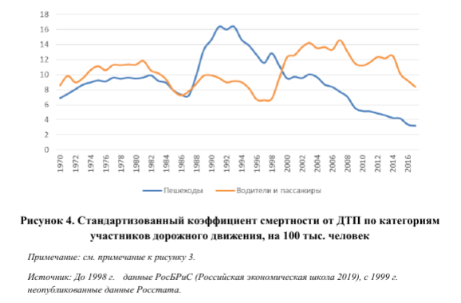

Как статистика поборола физику

К 2024 году СТАТИСТИКА смертей при ДТП в России должна быть приведена к европейскому уровню. 

Решение этой застарелой проблемы привело к тому, что с 2021 года ГИБДД считает статистику смертей и травм при ДТП по новому. 

Результат: отмена кинетической энергии. 

Категории: Статистика

## История вопроса

В Европе активное педалирование темы смертности при ДТП началось с конца 90-х - начала 2000-х годов. Появился комитет EuroNCAP со своими тестами пассивной безопасности, Еврокомиссия стала ориентироваться на смертность при ДТП в районе 3-4 человек на 100 тысяч населения, кое-кто пошел и дальше. Например, Норвегия заявляла о цели нулевой смертности к 2050 году. 

Итогом всего этого административного буйства стало массовое внедрение автомобильных систем безопасности в виде разнообразных подушек безопасности, ремней с преднатяжателями, ABS, трекинг-контролей и прочей электроники. Механизм очень простой: EuroNCAP изобрел сначала четырех, а затем пятизвездочный рейтинг безопасности, присваиваемый по определенным критериям новым автомобилям после краш-теста в виде удара о сминаемый барьер на скорости в 64 км/ч. 

Рейтинг был и остается унифицированным с делением только на типы транспортных средств: легковые, внедорожники, минивэны и так далее. Оставим очевидные вопросы про физику (ибо E=mU^2/2 и почему-то не меняется от усилий евробюрократов, см ниже) пока в стороне, а сосредоточимся на результате. А результат был колоссальным - родилась полноценная "культура пассивной безопасности" (дословный перевод одного из пресс-релизов EuroNCAP). 

Впрочем, родилась она или её родили - вопрос, как по мне, так весьма открытый, ведь по большому счету автоиндустрия к тому времени находилась в тупике - физические возможности базовой конструкции уже были высосаны до конца. Никаких глобальных прорывов не ожидалось: ни роста КПД ДВС хотя бы до 50%, ни качественного изменения конструкции трансмиссии. Более того, все 90-е годы у большинства автомобильных концернов Европы падала динамика роста продаж - оптимизированная конструкция тележек 80-х годов и их наследников позволяла обеспечить очень высокую по нынешним временам долговечность. Мифы про негниющие Ауди с номерами ZZZ, про движки-миллионники и прочее в том же духе именно оттуда, из тех конструкций. Убить какую-нибудь Вольво 240 было попросту тяжело, разве что об столб. В этих условиях появление новой конкурентной модели в свете активно распиаренной культуры пассивной безопасности вполне могло быть сочтено за великое благо. 

____

В России на эту движуху долгое время внимания в целом не обращали, руководствуясь не красивыми звездочками, а правилами ЕЭК ООН (по которым автомобиль бился о бетонный куб на 50 км/ч). Не считая евангелистов европейского подхода - газеты "Авторевю", организовавшей собственный аналог EuroNCAP - ARCap. "Исконно отечественные автомобили" (терминология газеты) показали себя в этой рейтинге отвратительно - дисперсия результатов была в районе двух баллов из 14-16, то есть по нормам EuroNCAP даже на одну звезду рейтинга поделки российских автозаводов могли претендовать только случайно. 
_____

На фоне развернувшейся борьбы за безопасность, европейские страны стали отчитываться о результатах. Оказалось, что уже к середине 2000-х удалось добиться в ряде стран кратного снижения смертности при ДТП. На фоне пропаганды пассивной безопасности эти цифры автоматически с ними увязались и тезис о прямой и однозначной связи снижения смертности при ДТП и оснащения автомобилей новомодными системами безопасности вкупе с переходом на высокпрочные стали (концепция "силовой клетки") оказался отлит в граните. 

Но не все так просто. Развитие всей этой пассивной культуры пассивной безопасности началось и продолжалось на фоне замены международного классификатора болезней МКБ-9 на классификатор МКБ-10, который иначе кодировал многие случаи смертей и травм при ДТП. Причем со страновой спецификой и, что особенно важно, с серьезными методологическими изменениями по классификаци смертей водителей/находящихся в авто и пешеходов, процент смертельных ДТП с которыми на общем фоне вырос. 

Иначе говоря, если абстрагироваться от кодификации случаев смерти, то напрашивается вывод о том, что пассивная культура привела к снижению риска смерти при ДТП для находящихся в автомобиле, но не снизила значимо рисков для пешеходов. Именно так это и было воспринято. В результате в пул уже ставших обязательными тестов EuroNCAP попало и испытание на риск для пешеходов, что привело к появлению целого нового рынка систем безопасности, апофеозом которого можно считать надувные подушки безопасности для пешеходов, внедренные целом рядом топовых производителей. Ну и к росту цены окончательных изделий на фоне постоянного снижения базовых технических издержек за счет унификации платформ и резкого снижения металлоемкости. То есть электроника и системы пассивной безопасности стали одним из важнейших факторов увеличения маржинальности для производителей среднего и высшего ценового сегмента. 

Но абстрагироваться от статистики учета не получится хотя бы по причине того, что динамика обновления автопарка на пассивно-безопасные, одобренные звездочками, изделия никак не соответствует динамике достижений. Иначе говоря, за 4-5 лет активного педалирования пассивной идеологии общая масса условно безопасных (в этом модусе) автомобилей не могла превысить 5-7% от всего автопарка. Иначе говоря, идеальный с точки зрения логики EuroNCAP вариант ДТП с двумя пассивно облагороженными автомобилям равной массы, имел примерно однопроцентные шансы состояться. То есть, динамику снижения ДТП по крайне мере ТОЛЬКО этим не объяснить. Без административного подхода и МКБ-10 результат был бы явно недостижим. 

## Целевые показатели

В директивном порядке не отставать от Европы по снижению числа ДТП на 100 тысяч населения Россия начала с 2018 года, когда был принят [Национальный проект "Безопасные и качественные автомобильные дороги"](http://static.government.ru/media/files/rBdyoIr3S9IDP8Q87lXXYaktpKWGc0NY.pdf), обещавший уже к 2024 году снизить показатель смертности при ДТП до европейского уровня в 4 смерти на 100 тысяч населения с 11,7 в 2017. Декларируемая динамика выглядела крайне фантастичной даже на фоне предыдущих достижений снижения смертности, по сравнению с которыми описанные европейские достижения - детский лепет. Подробный разбор этой ситуации есть в отличной работе [Пьянкова Анастасия Ивановна, & Фаттахов Тимур Асфанович (2019). Смертность от дорожно-транспортных происшествий в России: подходы к оценке, тенденции и перспективы. Демографическое обозрение, 6 (3), 58-84.](https://cyberleninka.ru/article/n/smertnost-ot-dorozhno-transportnyh-proisshestviy-v-rossii-podhody-k-otsenke-tendentsii-i-perspektivy).

Ничего, естественно, не вышло. ГИБДД начало заикаться о переносе сроков достижения показателей. Пробок.НЕТ по этому поводу сделали гаишникам подарок в виде красивой презентации с дизайнерской модной инфографикой, где в явном виде тезис был обозначен как "С уверенностью можно сказать, что изначальный показатель недостижим до тех пор, пока мы не научимся работать со статистикой" [Источник](https://fishki.net/auto/3392672-prichiny-smerti-na-rossijskih-dorogah-razbor-oficialynoj-statistiki.html). В итоге сроки достижения чуть не перенесли на 2030 год, а/но проблему статистики стали решать. 

[Абсолютно новые правила учета и сбора статистики о ДТП, количестве погибших и пострадавших разработало МВД России.](https://www.autonews.ru/news/5e94165a9a79477c5dac45d4). Соответствующий проект опубликован на правительственном портале regulation.gov.ru. Изменения вступили в силу с 1 января 2021 года. "Введение единого нового порядка учета ДТП по всей России не только снизит нагрузку на региональные отделения ГИБДД, но и позволит ведомству выйти на показатели, установленные в рамках федерального проекта «Безопасность дорожного движения» национального проекта «Безопасные и качественные автомобильные дороги»" (цитата из релиза по той же ссылке). 

Подход оказался очень близким к европейским практикам - убрать из статистики лишнее, а кодировать по возможности по другой причине смерти. Особенности кодирования в этих случах подробно и досконально (впервые в РФ) описаны у Пьянковой и Фаттахова, поэтому даже не надо повторяться. Думается, что трудности будут преодолены, умирать от ДТП люди приучатся в больнице, а пешеходы... 

## Пешеходы

А с пешеходами дело обстоит занятно. Дело в том, что по идее динамику ДТП-ных показателей в РФ вообще нельзя сравнивать с мировой. Разные системы кодирования, разные методологии, а несколько лет вообще не сопоставимы в принципе, так как кодирование ДТП просто не позволяло отделить четко, например, пешеходов от пассажиров, а в общей статистике Росстата отделить смерти от автомобильных ДТП от смертей на транспорте в целом. То есть, по большому счету, сплошь и рядом распространенные графики сравнения смертности с ЕС и прочим зарубежьем не имеют под собой толковых оснований. То же самое касается и исторических графиков наподобие динамики показателя с 1960 года. Там помимо описанного есть и нюанс невозможности отделения водителей от пешеходов. 

Эту работу сделали все те же Пьянков и Фаттахова. 

Из графика отлично видно, что в целом общий рост снижения суммарного показателя обеспечивается в первую очередь за счет снижения количества пострадавших пешеходов начиная с 2008 года, то есть с принятия на вооружения классификатора МКБ-10, по которому и кодируются ныне смерти. А вот общее количество смертей водителей... собственно, на картинке все видно и так.

Если пересчитать как сделано [здесь](http://www.demoscope.ru/weekly/2012/0527/tema03.php) все смертельные ДТП не на количество населения, а на количество автомобилей (это количество, впрочем, тоже не самая прозрачная величина), то окажется, что даже при правильной статистке дела обстоят неважно - даже после внедрения правильной статистики и достижения декларируемого ФЦП целевого показателя окажется (при условии отсутствия резкого роста автопарка одновременного), что шансы убиться все-равно будут в 1,7-2,5 раза выше, чем сейчас в Европе. Если же учесть еще и примат ДТП с пешеходами и особенности кодирования смертей, на что крайне мало влияет пассивная культура пассивных систем безопасности, то...

То получается, что физику не обманешь. Не обманешь и квадратичную зависимость между кинетической энергией и скоростью. Тем лучше дороги и выше средняя скорость, тем опасней и страшней ДТП. На это накладывается и постоянный рост средней массы легковых автомобилей - по оценкам ADAC только всяческие системы пассивно-активной безопасности добавили в среднем автомобилю 120-150 кг веса, мода на кроссоверы еще около 150. Плюс банальное увеличение количества автомобилей на одну и ту же площадь дорожной сети, что чисто статистически равносильно увеличению шансов на столкновение, но с уменьшением их тяжести в местах наибольшего скопления. То есть, в целом корреляцию между динамикой роста автопарка и динамикой изменения количества смертей (не пешеходов) от ДТП на количество автомобилей, никакие системы пассивной безопасности не отменили, а в лучшем случае сгладили, что отлично видно и по приведенному выше графику. За исключением периода с 2014 года, когда целевые показатели впервые оказались отлиты в граните. Кинетическая энергия оказалась поборенной административно. 

